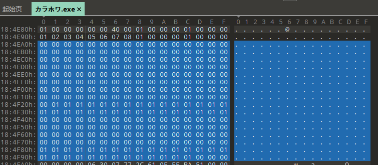
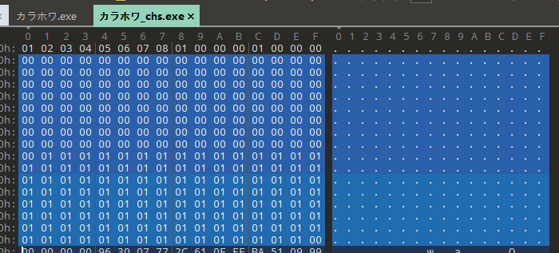

 补丁制作——从入门到入土 之：编码知识科普，与处理编码问题的常见思路

之前发的几篇存货都有点吓人，这下来发点基础的。

我们看到的文字，在计算机内部是以字节码的形式存储的。编码的规则决定了文字和字节码之间如何互相映射。用一种编码规则去解析另一种编码规则下的字节码，就会导致乱码。目前我们使用的大多是utf8、utf16这些支持几乎所有字符的编码；而由于种种历史原因，galgame中使用的编码通常是cp392，也就是常说的shift-jis(下简称sjis)。（插一句，由于种种历史原因，cp932其实是sjis的超集。ptyhon中cp932的编码范围比sjis要广，很多字符只能在cp932中编码，所以建议在python代码中使用cp932而不是sjis。但是出于习惯，下面还是以sjis称呼。）sjis是针对日文的一套编码规则，从这里（https://uic.jp/charset/show/cp932/）可以查看sjis的码表。可以看到在sjis编码规则中存在一部分汉字，但是在中文中使用的许多汉字在sjis编码中是不存在的，这给中文的显示带来了困难。所以，除去某些支持utf8、utf16编码的引擎（如krkr、新版BGI、artemis、ty等），在补丁制作时编码处理是一个绕不开的问题。

## 编码修改

既然sjis编码不支持很多汉字，那换一个编码不就好了！与sjis编码类似，gbk编码（cp936）是针对中文的一套编码，具体编码规则可以查看国标（GB2312）。gbk编码支持绝大部分中文、日文字符，能够实现汉化文本的显示。（但是注意，gal中常用的♪、♡等符号在sjis编码中支持，但在gbk中不支持，只能删掉。）

那么，怎么让程序以gbk编码读取文本呢？

第一，在将译文写入脚本时，需要以gbk编码写入。一些界面中用到的特殊符号（如某些游戏backlog中人名会用【】框起来）也需要在脚本中找到并修改为gbk。部分引擎的特殊格式标识（如yuris的注音标识≪／≫，某些引擎中表示一些内置特殊符号的标识如＃＠）则需要使用原sjis编码。

第二，大部分游戏都是使用gdi进行文本渲染的。使用CreateFont相关的函数时，会指定解码时使用的编码。通过dbg修改，或者通过APIhook修改，将charset参数从0x80（有时候是0x0）修改为0x86。这部分会在我的apihook教程和dbg操作教程中具体讲解。

第三，修改编码范围判定。sjis和gbk其实是长度不定的编码——有部分字符使用单字节编码，有的字符使用双字节编码。程序拿到一串字节，怎么确定下一个字是单字节还是双字节呢？通常是根据编码范围来确定的。sjis的第一个字节的范围 0×81-0×9F、0xE0-0xEF。如果第一个字节在这个范围内，则前两个字节为一个字。否则，第一个字节单独是一个字符。但是，坏消息是，gbk中的编码范围是不同的。gbk的第一个字节的范围是0×81-0xFE。如果一个gbk编码的字符第一个字节是\xB2\xE2（测），以sjis的编码范围进行检测时，会将\xB2认为是单独的一个字符，从而造成乱码。所以，我们需要使用dbg在内存中找到编码范围判断的位置，然后进行修改。编码范围判定的形式多样，不同引擎间操作、难度差别很大。有的是类似这种形式：

```
cmp al,81
jb xxxx
cmp al,9F
jbe xxxx
cmp al,E0
jb xxxx
cmp al,EF
ja xxxx
```

以上这个例子修改9f为fe即可。通常，可以尝试在dbg中搜索0x81、0x8140、0x9f、0xe0、0xef、0xa0等常数，找到类似的代码进行修改。还有些引擎使用了特殊的方式，比如yuris，以color of white为例，其在游戏exe中添加了这样一个0x100位的表：



分别对应了0x00-0xff，其中0×81-0×9F、0xE0-0xFD对应的字节为1，其余为0。将其进行修改：



这样就对应了gbk的编码范围。

总之，修改游戏为gbk的情况较为复杂，难度较高，有时还会引入很多问题需要处理。如果有成熟的教程，或对自己技术水平有信心，可以尝试。

## 码表映射

既然以上这些方法这么复杂，那么……干脆就保留sjis编码不就行了！

但是，不支持的汉字怎么办呢？既然原本的sjis编码不支持，那么我们在原本的sjis编码的编码范围内，重新定义一个编码不就行了！sjis编码中有许多奇奇怪怪的字，在中文显示时完全用不到。这里随机挑选一个，比如“僥”（\x99\x46）。然后，假设我们的译文里有“这”这个字，这个字在sjis编码中不存在。那我们直接让“这”占据“僥”的码位（\x99\x46）——在我们新定义的规则中，\x99\x46代表“这。我们要用“这”时，在脚本里写入\x99\x46就行了。

听起来很简单，但是……程序怎么知道我们的新规则？这里就有个比较取巧的办法了。我们可以创造一个字体，在这个字体中，\x99\x46对应的字形是“这”。程序在读到脚本里的“僥”时，根据原本的sjis的编码规则，去字体里寻找\x99\x46对应的字形并显示。但是我们给他的字体里，\x99\x46对应的是“这”的字形。程序原本想显示“僥”，但是通过我们给的字体，显示出来给我们看到的字形就是“这”。这样，就实现了中文的正常显示（希望看到这里的时候你还认识“这”这个字）。再或者，可以不修改字体，而是通过APIhook，处理游戏生成字形的函数（如DrawText、GetGlyphOutline、TextOut、ExtTextOut）来实现映射。

原理讲明白了，但是这个具体的实现较为复杂，需要在导入脚本时按照新编码规则进行替换、修改字体、修改游戏使用的字体等。不过别担心，有很多工具可以帮助自动化的完成这一过程。Sextractor可以配合universal inject framework实现字体映射。我自己也开发了一套工具来实现这一过程。
