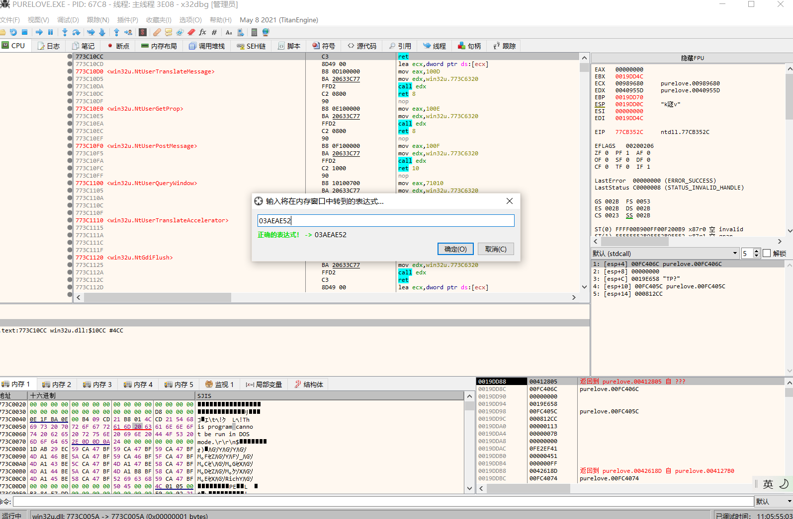
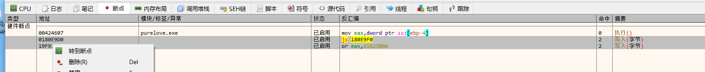

本篇文章演示的游戏为ぴゅあらっ！，引擎为椎名里绪v2.47。众所周知，椎名里绪的封包工具有未知bug，会导致封包的脚本中部分字节出错，导致bug。这里我们将试图通过逆向，找到程序中脚本读取相关的位置，实现脚本的免封包读取。

使用工具：

x64dbg，CheatEngine

# 启动游戏

这个游戏有一个奇怪的验证，比较复杂，但是直接用alsignup就能解决。同时，这个椎名里绪的游戏在win10上运行会有bug，有一个较为通用的补丁（opengl32.dll）能够解决。这两个工具都可以在附件中找到。转区即可启动游戏。

# 启动调试器

启动x32dbg，点击文件-附加

双击这一项，即可让dbg附加到游戏中。

启动cheat engine，点击左上角第一项：

双击这一项，即可让cheat engine附加到游戏中。

# 寻找文本

首先，我们要找到脚本在游戏内存中的位置。

游戏中点击start开始游戏，过到第一句文本：

用ocr之类的（日文好的话可以手打）获取到一个文本的片段，比如"ごめんなさい"。

在dbg的窗口中按ctrl+B，点击代码页按钮，找到shift-jis并双击选中。然后将前面的文本复制到shift-jis那一栏中，在下面的十六进制的框中可以看到这串文本对应的字节编码。选中下面的字节编码，并ctrl + C复制。

dbg中提供了一个从内存中搜索的功能，但是很不好用，这里我们使用cheat engine来搜索，这个搜索匹配特征的窗口可以关掉了。在cheat engine右上角，value type选到 array of byte，然后将刚刚复制的字节码复制到搜索框中。

点击first scan，即可搜索到游戏所占内存中"ごめんなさい"这段文本出现的位置：

选中一条搜索结果，然后按ctrl+C可以复制对应的地址。

然后重新回到x32dbg，选到下方的内存窗口，按下crtl + G，填入刚刚搜索结果中的一个地址：

（注：调节dbg下方显示代码页的方法：

内存窗口右侧右键，然后选中十六进制-代码页，找到shift-jis）

发现这里没有整个的脚本文件，只有一句话，不是我们想要的位置。上面还有几条搜索结果，依次尝试（注意要点到下方内存窗口后再按ctrl+G）。

最终发现，最后一个搜索结果处有游戏的脚本文件。

# 寻找写入脚本文件的位置

我们想要实现的是，让游戏读取的脚本文件来自我们自己没封包和加密的文件，所以需要找到游戏是从哪个地方读取脚本并写入内存的。dbg提供了一个写入断点的功能，可以在程序写入对应位置时停下。

但是，经过实验发现，游戏每次启动、读取每个脚本时，读取到的脚本的地址都不同，现在难以在游戏读取脚本前预见到脚本将要被写入的地址。

然而，根据经验，内存中通常会存在一个文件句柄，记录脚本文件的开头位置和目前正在读取的位置。现在来尝试一下。在内存中往前翻，找到脚本的开头位置（小知识：程序一般会对齐到4字节，所以脚本的开头的地址一般都是4的倍数，不确定哪里是开头的时候可以用这个来猜）：

alt+ins复制地址。

1E88E868

然后回到cheat engine，我们想要试试看在内存中搜索这个脚本开头的地址。点击new scan，value type选到4 byte，然后将刚刚复制的地址粘贴到搜索框中：

点击first scan开始搜索：

果然找到了两个位置。还是用刚刚的方法，在dbg中的内存窗口按ctrl+G转到对应的位置。

（注：如果有多个想要关注的位置，内存窗口上方有多个选项卡，可以分别聚焦不同的位置，方便查看）

好像……都差不多。我们快进游戏，让游戏读取到下一个脚本看看。

快进到第一个选项后，发现两个位置都变成了00

选择一个选项后，出现了新的内容：（另一边一样，就不截图了）

右键选中，然后点击在内存窗口中转到指定dword：（前面两个我们关注的位置放到了窗口1和2，所以这里选3以方便来回查看）

果然，这里对应了新读取的脚本的位置。

也就是说，每次读取新的脚本时，游戏会在一个相对固定的位置写入新读取的脚本开头的位置。

我们尝试在记录脚本开头的位置下写入断点（由于搜到的俩位置好像看着差不多，这里随便选一个位置下）

然后快进游戏，不一会儿就触发了断点：

这里时将这里写入0，我们不关心，按f9继续运行。

按f9后接着又触发了一次断点，这次是写入了一个地址：

这个就是我们关心的了。不出意外的话，这里就是脚本将要被放入的位置。转到对应的地方：

这里目前还是一片空白，做好了迎接脚本写入的准备（×）这样我们就找到了脚本将要被写入的地址，在这里下一个写入断点：

按f9继续运行程序，不出意外，一会儿就又触发了断点：

这里是一个rep stosd指令，通常用来初始化内存，不是我们关心的，不管，再按f9。一会儿后又触发了一次断点：

这个就是我们关心的了，可以看到这片内存中开始写入脚本了。（可以尝试按几次f7，可以观察到脚本被以4字节为一个单位写入内存中的过程）

这里是一个rep movsd指令，是我们很关注的一个指令，用于将esi处的内存复制到edi处，一次复制4字节，重复的剩余次数在ecx中。这里rep movsd已经重复了几次了，不好观察，我们再其上一行下断点来观察。（椎名里绪有反调试机制，所以必须选择设置硬件断点。其他的游戏直接选中然后按f2就行）

之前的两个断点我们不关心了，可以在断点选项卡中选中然后右键删除：

按f9，继续运行游戏，断点没触发，我们需要继续快进游戏，到游戏读取下一个脚本的位置。快进一段后，断点触发：

右键点击esi，在内存中转到esi对应的位置：

发现esi中为游戏的脚本文件的内容。正如之前所介绍的，rep movsd是将esi对应的内容复制到edi中。再继续观察，注意到脚本文件的大小记录在edx中，还注意到ecx为脚本长度除4（向下保留的整出）：（看起来是注意力惊人，不过仔细读一下这段汇编代码应该也不难看出）

在左下角的栈中还观察到，esp - 8的位置是要读取的脚本的文件名：

现在思路就清晰了。从esp - 8的位置获取文件名，然后尝试根据文件名读取未封包的翻译后的脚本，然后用翻译后的脚本的内容替换esi中的内容，并且根据新的脚本的长度修改edx和ecx的值，就能实现“免封包”读取了。先简单的实验一下：

f9运行：

确实修改这里的esi处的脚本能够修改游戏的文本显示。

剩下的内容就是如何使用程序来实现这一点了，具体的实现方法我应该会之后讲解。

# 结语

某位大佬曾经说过：其实汉化游戏我们甚至可以不管它用了什么加密，直接hook这里然后替换为其他缓冲区。但是这样就没有分析的意义了，为了练习和游戏封包兼容性，我们最好还是要去分析算法。

所以，这篇文章里的方法其实是下策，是非常不优雅的，并没有使用游戏原本的文件读取接口，而是直接找个地方暴力替换。但是，我能力有限……能用不就行了吗【躺】。
